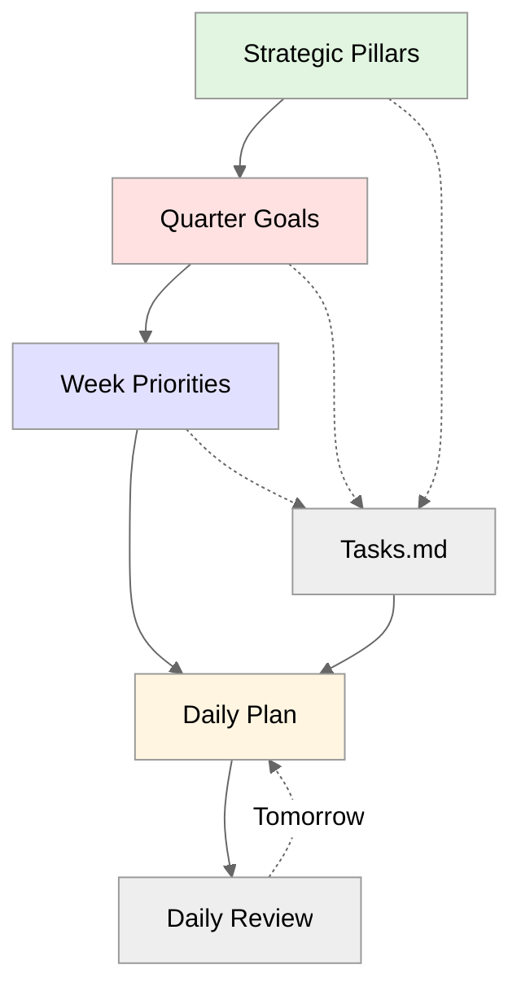

# Dex — Your AI Chief of Staff

**A personal operating system powered by Claude.**

Clone this repo, run the installer, type `/setup` in Claude, tell it your role — and in 10 minutes you have a working system tailored to how you work. Strategic work management, meeting intelligence, relationship tracking, daily planning. All configured for whether you're a CMO, a sales leader, a PM, or any of 31 roles.

No coding required. Just [Cursor](https://cursor.com) and conversation.

Companion to [Episode 8 of The Vibe PM Podcast](https://youtu.be/WaqgSvL-V10?si=b2Pfwf7I5rozWCo0) and the [full blog post](https://www.linkedin.com/pulse/your-ai-chief-staff-building-personal-operating-system-dave-killeen-yxnqe/).

---

## Who This Is For

Non-engineers.

Product managers, marketers, sales leaders, designers, executives, HR leaders, consultants, coaches, analysts — anyone who wants the same leverage from AI that technical people have had access to.

**You don't need to know how to code.** Just follow the setup and talk to your AI assistant.

**If you're an engineer:** Share this with your non-technical colleagues. Distribute Dex across your organization to accelerate AI fluency adoption. When teams build shared understanding of what AI can reliably do (not just chat interfaces, but actual operating systems), you compete far more effectively.

---

## Built to Teach: The AI Fluency Catalyst

Most people in tech use AI as a chat interface - asking questions, getting answers, starting fresh every time. They've seen the demos but don't understand how to move beyond that. The gap between what's possible and what people actually use continues to widen.

Dex addresses this by giving you a working system immediately. No learning curve, no setup burden.

The system automates cognitive overhead - you reclaim hours in your day. Meeting prep happens automatically. Commitments don't slip. Context is always available before calls. The time you save compounds: less administrative work means more focus on strategic work and career-advancing goals.

The system teaches you as you go. Start shallow, go deep as you get curious. Two weeks of daily practice and you're in flow. By month one, you don't just have a working system - you understand how to build systems.

**For teams and organizations:** One person adopts Dex, sees the value, shares it with colleagues. Technical leaders can distribute the repo (everyone gets the same foundation, adapted to their role) or share demo mode (let people explore without committing their own data). Teams develop common language around what AI can reliably do. Your organization moves from AI demos to AI operations.

**Want to share this?** Point colleagues to the [companion blog post](https://www.linkedin.com/pulse/your-ai-chief-staff-building-personal-operating-system-dave-killeen-yxnqe/) for the full story with more detail and color about how everything comes together. At the bottom of this README, there's a ready-to-use message you can copy and paste to share with your team - makes it easy to accelerate AI fluency adoption across your organization.

---

## Getting Started

<details>
<summary><strong>Click to expand setup and installation guide</strong></summary>

### What You'll Need

1. **[Cursor](https://cursor.com/)** - Download and install (free account works fine)
2. **[Git](https://git-scm.com)** - Required for setup and updates
   - **Mac:** Installs automatically when needed (you'll see a prompt)
   - **Windows:** Download from [git-scm.com/download/win](https://git-scm.com/download/win)
3. **[Node.js](https://nodejs.org/)** - Download the "LTS" version and install (this enables the system's automation features)
4. **[Python 3.10+](https://www.python.org/downloads/)** - Download and install (required for MCP servers and task sync)
   - **Minimum version:** Python 3.10 or newer
   - **Windows users:** ⚠️ During installation, check the box "Add Python to PATH" - this is critical
   - **Mac users with old Python:** If you have Python 3.9 or older, download fresh from python.org

All installers walk you through setup with default options.

**Why Python 3.10+?** The MCP SDK (Model Context Protocol) requires Python 3.10 or newer. This powers the Work MCP server that enables task sync - when you check off a task in a meeting note, it updates everywhere automatically (person pages, project files, Tasks.md).

**Mac users:** If this is your first time using command-line tools, macOS will prompt you to install "Command Line Developer Tools" during setup. Click **Install** when prompted - it's safe and required. Takes 2-3 minutes.

### About the Command Line

You'll use something called a "command line" (or "Terminal" on Mac, "PowerShell" on Windows) during setup. This is a text-based way to give your computer instructions - think of it as typing commands instead of clicking buttons.

**Don't worry if this feels unfamiliar.** You'll copy and paste a few commands, press Enter, and you're done. Takes less than 2 minutes.

### Check Your Setup (Optional)

Want to verify everything's ready? Open your command line:
- **Mac:** Press `Cmd+Space`, type "Terminal", press Enter
- **Windows:** Press `Win+R`, type "powershell", press Enter

Copy and paste this line **exactly as you see it**, then press Enter:

```bash
git --version
```

**You should see a response like:** `git version 2.x.x` (any version number is fine)

**If you see "command not found":** Download Git from [git-scm.com](https://git-scm.com), install it, then close and reopen your command line and try again.

---

Now copy and paste this line, then press Enter:

```bash
node --version
```

**You should see a response like:** `v18.x.x` or `v20.x.x` (must be version 18 or higher)

**If you see "command not found":** Download Node.js from [nodejs.org](https://nodejs.org), install it, then close and reopen your command line and try again.

---

Finally, check Python:

```bash
python3 --version
```

**Windows users:** Try `python --version` if `python3` doesn't work.

**You should see a response like:** `Python 3.10.x` or higher (3.11, 3.12, etc.)

**If you see Python 3.9 or older:** The MCP SDK requires Python 3.10+. Download and install a newer version:
- **Mac/Windows:** Download from [python.org](https://www.python.org/downloads/) (get the latest stable version)
- After installing, restart your terminal and check the version again

**If you see "command not found":**
- **Windows:** Python likely isn't in your PATH. Reinstall from [python.org](https://www.python.org/downloads/) and check "Add Python to PATH" during installation. Restart your terminal after.
- **Mac:** Download Python from [python.org](https://www.python.org/downloads/), install it, then restart your terminal.

**Why Python 3.10+ matters:** It powers the MCP servers that sync tasks everywhere. Check off a task in a meeting note → it updates in your Tasks.md, person pages, and project files automatically. Python 3.9 and older won't work - you need 3.10 or newer.

---

**That's the technical heavy lifting done.** If you got through that, the rest is straightforward - just clicking buttons and answering questions.

### Step 1: Get the Code into Cursor

1. Open **Cursor**
2. Press `Cmd+Shift+P` (Mac) or `Ctrl+Shift+P` (Windows) - this opens a search bar at the top
3. Type **"Git: Clone"** and press Enter
4. Paste this URL and press Enter:
   ```
   https://github.com/davekilleen/dex.git
   ```
5. Choose where to save it (your Documents folder works great)
6. Click **Open** when Cursor asks if you want to open the folder

**Can't get this working?** No problem:
1. Go to [github.com/davekilleen/dex](https://github.com/davekilleen/dex)
2. Click the green **Code** button → **Download ZIP**
3. Unzip to your Documents folder (the folder will be named `dex-main`)
4. In Cursor: **File → Open Folder** → select that `dex-main` folder

### Step 2: Run the Installer

Inside Cursor, you'll see a panel at the bottom (or go to **View → Terminal**). This is where you'll type commands.

Copy and paste this command and press Enter:

```bash
./install.sh
```

**What's happening:** This installs the automation that makes Dex work (task sync, career tracking, meeting intelligence). Takes 1-2 minutes. You'll see text scrolling - that's normal.

**When it's done:** You'll see your cursor blinking again, ready for the next command.

⚠️ **IMPORTANT: You're not done yet. Complete Steps 2B and 3 to finish setup.**

**Verify MCP servers:** Cursor should automatically detect `.mcp.json` and enable the MCP servers. Look for the MCP icon in Cursor's bottom panel - you should see server names with green checkmarks.

**If you see errors:** The most common issue is Python dependencies. First upgrade pip, then install packages:

```bash
python3 -m pip install --upgrade pip
pip3 install --user mcp pyyaml
```

Then restart Cursor.

⚠️ **IMPORTANT: Complete Step 3 now to configure your role - this is what makes Dex work.**

<details>
<summary><strong>Troubleshooting: Common Setup Issues</strong></summary>

### Mac: "Command Line Developer Tools" prompt

If you see a popup asking to install "Command Line Developer Tools":

1. **Click Install** - This is safe and necessary for git to work
2. **Wait 2-3 minutes** - The installer downloads and installs automatically
3. **Setup continues automatically** - Once tools are installed, the script resumes

This only happens once. Future updates won't need this.

**What if I accidentally clicked "Cancel"?**

Run this command, then run `./install.sh` again:

```bash
xcode-select --install
```

---

### Windows: "python is not recognized" or "pip is not recognized"

This means Python wasn't added to your PATH during installation.

**Fix:**

1. Uninstall Python (Control Panel → Programs)
2. Download fresh installer from [python.org](https://www.python.org/downloads/)
3. Run installer
4. ⚠️ **CHECK THE BOX: "Add Python to PATH"** (on first screen)
5. Complete installation
6. **Restart your terminal completely** (close and reopen)
7. Run `./install.sh` again

---

### Windows: "git is not recognized"

Git for Windows isn't installed.

**Fix:**

1. Download from [git-scm.com/download/win](https://git-scm.com/download/win)
2. Run installer with default options
3. **Restart your terminal**
4. Run `./install.sh` again

---

### All Platforms: "Could not install Python dependencies"

The installer tries two methods automatically. If both fail, your pip version might be too old.

**Fix (upgrade pip first, then install):**

```bash
python3 -m pip install --upgrade pip
pip3 install --user mcp pyyaml
```

**Windows:**

```bash
python -m pip install --upgrade pip
pip install --user mcp pyyaml
```

---

### MCP Servers Show Errors in Cursor

If you see red error indicators next to MCP server names in Cursor:

**"No server info found" error:**

This means the Python MCP servers can't start. Most common fix (upgrade pip first):

```bash
python3 -m pip install --upgrade pip
pip3 install --user mcp pyyaml
```

Then **restart Cursor completely** (Cmd+Q and reopen, or File → Quit).

**If you get "ERROR: Could not find a version that satisfies the requirement mcp":**

Your pip is too old. Run the pip upgrade command above first, then try installing packages again.

**"Command 'python' not found" error:**

Your `.mcp.json` might have the wrong Python command. Open `.mcp.json` in your vault and change all instances of:

```json
"command": "python"
```

to:

```json
"command": "python3"
```

(Or vice versa on Windows - use whichever command works in your terminal)

Then restart Cursor.

**Still not working?**

Check the MCP server output:
1. Click the error indicator in Cursor's MCP panel
2. Click "Show Output"
3. Look for the specific error message
4. Common issues: missing Python packages, wrong file paths, Python version too old

</details>

### Step 3: Tell Dex About Your Role

In Cursor, look for a **chat panel** (usually on the right side of the screen). This is Claude - your AI assistant.

**Here's exactly what to do:**

1. **Click inside the chat panel** where it says "Message Claude..." or similar
2. **Type exactly this:** `/setup`
3. **Press Enter** - This invokes the setup skill
4. **Wait ~30 seconds** - First time setup needs to load everything (you'll see "Thinking..." while it works)
5. **Press Enter again** - Claude will now start asking questions
6. **Answer each question naturally:**
   - What's your role? (e.g., "CFO", "VP Sales", "Product Manager")
   - Company size?
   - What are your main focus areas?

Just type your answers like you're texting a colleague. Takes about 2 minutes total.

**When it's done:** You'll see confirmation that your workspace is configured. All folders, commands, and automation are now tailored to your specific role.

---

## Three Ways to Access Claude

You just used **Cursor** to run setup. That works great for daily use.

There's also **Claude Code** - a more powerful option available via command line or Desktop app. Both give you **guaranteed hooks** (automatic behaviors that run deterministically, unlike CLAUDE.md which Claude might skip).

| Access Method | What You Get | Hooks? | Setup |
|--------------|--------------|--------|-------|
| **Cursor** | Easy, already working | No | Already done |
| **Claude Code** (command line) | Guaranteed hooks, persistent learning | Yes | 5 min install |
| **Claude Code** (Desktop app) | Guaranteed hooks, persistent learning | Yes | 5 min install |

**What are hooks?** Automatic behaviors triggered by events (session start, file read, etc.). They're deterministic - they ALWAYS run. Context loads guaranteed, learnings surface guaranteed, person details inject guaranteed.

**Which to use?**
- **Start with Cursor** - you're already set up
- **Add Claude Code later** if you want guaranteed automation

### What You Get With Each

**Cursor:**
- ✓ Full vault access
- ✓ Multiple terminal windows for parallel work
- ✓ Works immediately
- ✗ No guaranteed hooks (context loading is probabilistic)

**Claude Code (command line or Desktop):**
- ✓ Everything Cursor does
- ✓ PLUS guaranteed hooks for persistent learning and automatic context

| Hook Example | What It Does |
|--------------|--------------|
| **Session start** | Loads Quarter Goals, Week Priorities, Strategic Pillars, Urgent Tasks automatically |
| **Person context** | When Sarah is mentioned in a file, her person page context injects automatically |
| **Company context** | When Acme Corp is referenced, company page details inject automatically |
| **Mistake patterns** | Surfaces active patterns so Claude avoids repeating them |
| **Learning reminders** | Prompts review when you have 5+ unreviewed learnings |

**Command line vs Desktop:** Same core capabilities, different interfaces. Command line is text-based terminal. Desktop is a GUI with visual session management and side-by-side diffs.

**Bottom line:** Cursor works great and is what most people use. Claude Code guarantees hooks run every time, making the system more intelligent and persistent. Many people use both - Cursor for heavy editing, Claude Code for workflows where reliability matters.

[Full hooks documentation →](https://code.claude.com/docs/en/hooks)

---

## Want Guaranteed Hooks? Use Claude Code (CLI or Desktop App)

You're already set up with Cursor. If you want guaranteed hooks (automatic context loading every session), here are your two options:

### Option 1: Claude Desktop App

If you prefer visual interfaces over command line, use the Desktop app.

**Requirements:**
- Claude Pro ($20/month) or Max ($100-200/month, 5-20x higher usage limits) subscription - free Claude accounts don't have access to Claude Code

**Setup (2 minutes):**

1. Download from [claude.ai/download](https://claude.ai/download)
2. Install and open the app
3. Log in with your Claude Pro or Max account
4. Click the **Code** tab (top left)
5. Select your Dex folder to start a session

**That's it.** Hooks run automatically - session start context loads, person details inject when mentioned, mistake patterns surface.

**Desktop app benefits:**
- **Visual interface** - See all sessions, review changes with side-by-side diffs
- **Multiple parallel sessions** - Click "+ New session" to work on different tasks simultaneously
- **Built-in integrations** - Connect Calendar, Slack, GitHub without manual configuration
- **Same guaranteed hooks** as command line

---

### Option 2: Command Line

For those comfortable working in Terminal (Mac) or PowerShell (Windows), Claude Code runs from the command line.

**Requirements:**
- Claude Pro ($20/month) or Max ($100-200/month, 5-20x higher usage limits) subscription - free Claude accounts don't have access to Claude Code

**Step 1: Install**

You can install from your system's native terminal or from within Cursor (easiest since you're already there).

**Option A: Native Terminal/PowerShell**

**Mac - Terminal:**
```bash
curl -fsSL https://claude.ai/install.sh | bash
```

**Windows - PowerShell:**
```powershell
irm https://claude.ai/install.ps1 | iex
```

**Option B: From Inside Cursor (Easiest)**

1. In Cursor, go to **View → Terminal** (opens a panel at the bottom)
2. Copy and paste the command for your system:

**Mac:**
```bash
curl -fsSL https://claude.ai/install.sh | bash
```

**Windows:**
```powershell
irm https://claude.ai/install.ps1 | iex
```

The installer automatically updates itself in the background to keep you current.

**Step 2: Authenticate**

In your terminal (native or Cursor's), run:

```bash
claude auth
```

This opens your browser. Log in with your Claude Pro or Max account.

**Step 3: Start Claude Code**

From your terminal, navigate to your Dex folder and run `claude`.

**Note:** Folder name depends on how you got the code:
- If you **cloned via Git**: folder is named `dex`
- If you **downloaded ZIP**: folder is named `dex-main`

**Mac:**
```bash
cd ~/Documents/dex        # or dex-main if you downloaded ZIP
claude
```

**Windows:**
```cmd
cd %USERPROFILE%\Documents\dex        # or dex-main if you downloaded ZIP
claude
```

---

**Need help?** See [official Claude Code setup docs](https://code.claude.com/docs/en/setup) for troubleshooting.

**Which option?** Desktop app for visual interface. Command line for those comfortable in Terminal/PowerShell. Both give you the same guaranteed hooks capability.

</details>

---

## What It Actually Does

Eight jobs that happen reliably every day:

| Job | What It Solves |
|-----|----------------|
| **Start Each Day Focused** | One command gives you three priorities. Heavy meeting day? Drops to two. Won't let you overcommit. |
| **Never Miss a Commitment** | Promises made in meetings extracted automatically. Three days old? Flagged. You can't forget. |
| **Track Relationships** | Before any call: what you discussed last time, open items, what they care about. Never walk in cold. |
| **Accelerate Career Growth** | Captures evidence automatically. Feedback from 1:1s, achievements, skills growth. Review-ready when you need it. |
| **Manage Tasks Reliably** | Work MCP syncs tasks with unique IDs across all files. Check off once, updates everywhere. Deduplication prevents doubles. Priority limits stop overcommit. Strategic alignment required. |
| **Reflect & Improve** | Captures mistakes → rules. Learns preferences. Each session makes the next better. |
| **Keep Projects Moving** | Auto-detects stalls (12+ days no update). Surfaces blockers. You know what needs attention. |
| **Evolve Itself** | System suggests improvements based on usage patterns. Monitors Claude Code releases daily - when new capabilities drop, explains what they mean for YOUR system and suggests implementations. Captures your improvement ideas too. AI ranks all by impact. `/dex-improve` plans implementation. System adapts to you. |

**Want deeper context?** See [Dex_Jobs_to_Be_Done.md](06-Resources/Dex_System/Dex_Jobs_to_Be_Done.md) for the full framework.

---

## What's Included

Out of the box, working immediately:

- **8 core capabilities** - Daily focus, relationship tracking, commitment management, career evidence, task sync that actually works, learning system, project health monitoring, system evolution (see jobs table above)
- **Complete planning system** - Quarterly goals → weekly priorities → daily plans, all connected with rollup tracking
- **25+ ready-to-use skills** - `/daily-plan`, `/meeting-prep`, `/career-coach`, `/week-review` and more - invoke with `/skill-name`
- **Role-based setup** - 31 roles from CEO to IC, scaffolds appropriate folder structure and workflows. Onboarding MCP enforces validation (email domain required for Internal/External person routing) with session resume capability
- **Meeting intelligence** - Process transcripts into structured notes with action items auto-synced. Works with Granola MCP (included), or paste transcripts from any source - system recognizes and processes them
- **Task management with unique IDs (Work MCP)** - Tasks sync everywhere automatically (meeting notes, person pages, project files). Check off once, updates everywhere. Deduplication prevents doubles. Priority limits stop overcommit.
- **Career development coach** - Captures evidence automatically, prepares reviews, assesses promotion readiness
- **Person & company pages** - Relationship context for individuals + organization-level rollups (contacts, meetings, tasks)
- **Compound learning** - Captures preferences and mistakes. Every session makes the next one better.
- **Self-upgrading system** - Checks for new Claude Code features daily. When detected, explains what they mean for YOUR system and suggests implementations. Like having a concierge who reads release notes you'll never read.
- **Feature discovery** - `/dex-level-up` suggests capabilities you haven't tried yet based on your usage patterns

## The Journey to Competitive Advantage

**Week 1:** Use the scaffolded system. Value is immediate - commitments don't slip, meetings have context, day starts focused. System teaches you as you go.

**Week 2:** Start extending. Tell Claude what you need, it builds it. Not coding - just describing. Add integrations, customize workflows, adapt to your exact role.

**Month 1:** You're thinking like a builder. Understanding capabilities, spotting opportunities to automate, designing systems. AI fluency - the kind that compounds.

**Why this matters:** Time saved → invested in learning → deeper fluency → more sophisticated builds → greater impact → career advantage. The gap is widening now. People building these systems in Q1 2026 will have a year's advantage by summer.

**Total investment:** 30 minutes to set up. Two weeks to competence. The fluency compounds weekly.

---

## Conversational Capture

Ideas die between having them and recording them. Deciding where things belong kills momentum.

Dex handles this through natural conversation. Just tell Claude things naturally:

```
You: "Sarah seemed worried about timeline but interested in Q2 pilot"

Claude: "I see you have 'Sarah's team onboarding' and 'Q2 Planning' 
in your Week Priorities. Should I add this to Sarah's person page 
and the Q2 Planning project?"

You: "Yes"
```

That's it. No special commands. No files to organize.

**Strategic intelligence:**
- Loads your Week Priorities and Quarterly Goals
- Suggests routing based on what you're actually focused on
- "Mobile app pricing" → sees "Mobile App Launch" in priorities → HIGH confidence
- Person mentioned in priorities → routing gets confidence boost

One decision instead of many. Immediate filing.

---

## Career Development That Compounds

Great work happens daily, but evidence disappears. Review time becomes a scramble to remember what you accomplished.

Run `/career-setup` once (job description, career ladder, recent review, growth goals). From that point forward, Dex automatically captures career evidence:

| When | What Gets Captured |
|------|-------------------|
| Daily reviews | Achievements worth saving for promotion discussions |
| Manager 1:1s (via Granola) | Feedback and development context |
| Project completions | Impact and skills demonstrated |
| Weekly reviews | Work tagged with career skills |

### Your Personal Career Coach

Run `/career-coach` anytime for:

| Mode | What It Does |
|------|--------------|
| **Weekly Report** | Generate professional update for your manager in 30 seconds |
| **Monthly Reflection** | Spot patterns — what's working, where to focus |
| **Self-Review** | Build annual review from accumulated evidence |
| **Promotion Assessment** | Gap analysis with specific development plan |

The coach adapts to your career level. Evidence compounds. The longer you use it, the more powerful it becomes.

Your data stays on your laptop. It's yours.

---

## Task Sync That Actually Works

Tasks in multiple places (meeting notes, project files, person pages) don't sync in traditional systems. Check off one, others stay open.

Dex handles this with the **Work MCP server** - a Python-based automation layer that syncs tasks with unique IDs across your entire vault. When you process a meeting, action items get IDs like `^task-20260128-001`. Tasks appear in both the meeting note and `03-Tasks/Tasks.md` with the same ID.

Just tell Dex what you finished in natural language:
- "I finished following up with John"
- "Mark the proposal done"  
- "Completed the API docs"

The Work MCP finds the ID, updates everywhere automatically (Tasks.md, meeting notes, person pages, project pages), adds timestamp: `✅2026-01-28 14:35`.

No manual syncing. No duplicates getting out of sync. One source of truth.

**This is why Python installation is required** - the Work MCP server is the automation engine that makes task sync reliable and automatic.

---

## How the Planning System Works

Everything connects — from strategic pillars down to today's work:



**Strategic Pillars** (your focus areas) → **Quarter Goals** (3-5 outcomes over 3 months) → **Week Priorities** (Top 3 this week) → **Daily Plan** (today's work) → **Tasks.md** (backlog tagged to goals).

Work backwards from career impact: *What would make you incredibly happy you accomplished three months from now?* Quarterly goals become the north star connecting daily work to career-defining outcomes.

See [Dex_System_Guide.md](06-Resources/Dex_System/Dex_System_Guide.md) for details.

---

## Built-In Feature Discovery

You're likely using 20% of the system's capabilities because you don't know what you don't know.

Run `/dex-level-up` for progressive disclosure based on your actual usage. The system tracks which features you've used (stored locally in `System/usage_log.md`). When you run the command, it:

1. Analyzes your usage patterns - what you're already doing consistently
2. Identifies natural next steps - features that build on current habits
3. Shows 2-3 specific suggestions - never overwhelming, always relevant
4. Adapts to experience level - beginners get basics, power users get advanced features

Week 1: suggests daily review workflows. Week 3: suggests custom MCP integrations.

The system teaches you progressively. You learn what you need, when you need it.

---

## Demo Mode

Want to explore without adding your data? Want to show colleagues what's possible before they commit?

Run `/dex-demo on` for pre-populated sample content that demonstrates **all 8 Jobs to Be Done**:

**What's included:**
- **Career Development System** - Role definition, career ladder (L4→L5), performance reviews, growth goals, evidence library
- **Full Week of Planning** - Daily plans (Mon-Fri), weekly plan, morning/evening journals, weekly reflection  
- **Learning & Reflection** - Working preferences, mistake patterns, session learnings, pattern recognition
- **Company Intelligence** - Acme Corp page aggregating contacts, meetings, and tasks across the organization
- **Active Projects** - Mobile launch (high-stakes), portal redesign, API partnerships
- **Meeting Intelligence** - Week of notes with scattered tasks for `/triage` to demonstrate cleanup workflow
- **System Evolution** - Improvement backlog with 10 AI-ranked ideas, usage tracking, orphaned ideas
- **People & Relationships** - 5 person pages (internal/external) with meeting history and context

Everything happens in `System/Demo/` - your real vault stays untouched. Run `/dex-demo off` to switch back. Reset demo content anytime with `/dex-demo reset`.

Useful for:
- Exploring features risk-free before adding real data (see all 8 Jobs in action)
- Demoing to colleagues - show what AI systems can do beyond chat
- Driving AI fluency across your team without setup friction
- Testing new workflows and commands (`/career-coach`, `/dex-backlog`, etc.)

---

## The System That Improves Itself

The system captures learnings and improves over time:

- Run `/daily-review` - captures learnings to `System/Session_Learnings/`
- Weekly synthesis (`/week-review`) - turns learnings into system improvements
- Background automation - checks for new Claude Code features daily
- Run `/dex-whats-new` - surfaces learnings and new capabilities you can use

What gets captured:
- Mistake patterns become rules that prevent repetition
- Working preferences (communication style, meeting habits, tool choices)
- System improvements - AI suggests implementations based on your usage

Day 1: helpful but generic. Week 2: knows your preferences, catches common mistakes. Month 1: adapted to your specific work style.

Each session makes the next one better.

---

## Supported Roles

31 role configurations. The scaffolding changes completely based on your answer.

<details>
<summary>View all roles</summary>

**Core Functions:** Product Manager, Sales, Marketing, Engineering, Design

**Customer-Facing:** Customer Success, Solutions Engineering

**Operations:** Product Operations, RevOps/BizOps, Data/Analytics

**Support Functions:** Finance, People (HR), Legal, IT Support

**Leadership:** Founder

**C-Suite:** CEO, CFO, COO, CMO, CRO, CTO, CPO, CIO, CISO, CHRO, CLO, CCO

**Independent:** Fractional CPO, Consultant, Coach

**Investment:** Venture Capital / Private Equity

</details>

---

## What It Costs

| Item | Cost |
|------|------|
| Cursor Pro | $20/month (Claude included) |
| Cursor Free | $0 (limited usage, enough to try it) |
| Time | 10 minutes to set up |
| Coding skills | None required |

---

## Documentation

Comprehensive guides included in the repo:

- [Dex_System_Guide.md](06-Resources/Dex_System/Dex_System_Guide.md) - Complete feature reference and workflows
- [Dex_Jobs_to_Be_Done.md](06-Resources/Dex_System/Dex_Jobs_to_Be_Done.md) - Why each piece exists and how they connect
- [Dex_Technical_Guide.md](06-Resources/Dex_System/Dex_Technical_Guide.md) - Technical deep dive for those who want it
- [Folder_Structure.md](06-Resources/Dex_System/Folder_Structure.md) - PARA organization explained
- [Updating_Dex.md](06-Resources/Dex_System/Updating_Dex.md) - How to safely update while preserving customizations

Start with what you need. Go deeper if you're curious. No forced learning paths.

These guides live in your vault after setup.

---

## Updating Dex

**Get updates with one command - no technical knowledge needed.**

### Automatic Notifications

Dex checks for updates every 7 days during `/daily-plan`:

```
🎁 Dex v1.3.0 is available. Run /dex-update to see what's new and update.
```

### Update in One Command

```
/dex-update
```

**That's it.** Dex shows you what's new, you confirm, and then it handles everything:
- ✓ Downloads latest version
- ✓ Protects your data (never touches notes/tasks/projects)
- ✓ Handles conflicts automatically
- ✓ Creates safety backup
- ✓ Shows progress at every step

**Time:** 2-5 minutes  
**Technical knowledge:** None  
**Risk:** Zero - your data is always safe

### If Something Goes Wrong

```
/dex-rollback
```

Instantly restores the previous version.

### Your Data Is Protected

Updates never touch:
- Your notes, tasks, projects, people pages
- Your configuration (pillars, user profile)
- Your customizations
- Your API keys

**For detailed instructions:** See [Updating_Dex.md](06-Resources/Dex_System/Updating_Dex.md)

---

## AI Model Options (Optional)

Dex works with Claude by default, but you can also use cheaper cloud models or offline local models.

**Why configure alternatives?**
- **Save money:** Budget cloud models cost 80-97% less for routine tasks
- **Work offline:** Download a model to use on planes, trains, or without internet
- **Privacy:** Local models keep your data on your computer

**Configure your options:**

```
/ai-setup
```

**What this offers:**
- **Budget Cloud** — Kimi K2.5, DeepSeek (~$5-10 upfront, then very cheap)
- **Offline Mode** — Qwen 2.5 running locally (free forever, requires 8GB+ RAM)
- **Smart Routing** — Automatically pick the best model per task

**Check your configuration:**

```
/ai-status
```

**For detailed guide:** See [AI_Model_Options.md](06-Resources/Dex_System/AI_Model_Options.md)

---

## Obsidian Integration (Optional)

Dex works great with [Obsidian](https://obsidian.md) for visual graph navigation.

**Why Obsidian?**
- See your entire knowledge system as connected nodes
- Click any reference to jump instantly between people, projects, meetings
- Bidirectional task sync (check boxes in Obsidian → syncs everywhere)

**Enable Obsidian mode:**

```
/dex-obsidian-setup
```

**What this does:**
- Converts all references to clickable wiki links
- Generates optimized Obsidian config (optional)
- Enables bidirectional sync daemon (optional)

**Time:** 1-2 minutes even for large vaults  
**Safe:** Creates git backup before any changes

**New to Obsidian?** Watch this [beginner's guide (5 min)](https://www.youtube.com/watch?v=gafuqdKwD_U).

Obsidian is completely optional - Dex works perfectly in Cursor/terminal alone. Some users love the graph visualization for navigating their knowledge, others prefer the speed of terminal/Cursor. Both are first-class experiences.

**Learn more:** See [Obsidian_Guide.md](06-Resources/Dex_System/Obsidian_Guide.md)

---

## Resources

- [Vibe PM Episode 8](https://youtu.be/WaqgSvL-V10?si=b2Pfwf7I5rozWCo0) — Video walkthrough
- [Companion Blog Post](https://www.linkedin.com/pulse/your-ai-chief-staff-building-personal-operating-system-dave-killeen-yxnqe/) — Deep dive on all the concepts
- [Cursor](https://cursor.com) — The AI-powered editor
- [Granola](https://granola.ai) — Meeting transcription (optional)

---

## Share the Vibes

Found this useful? Share with colleagues:

> I've been using an AI operating system for the past few weeks that completely changed how I think about AI tools. It's not just another chat interface — it's a personal chief of staff that manages my day-to-day work (meeting prep, task sync, relationship tracking, strategic planning).
>
> Here's what surprised me: the system teaches you AI fluency as you use it. You start with pre-built workflows, but within two weeks you're extending it yourself — not coding, just describing what you need and watching it build. It's basically a hands-on course disguised as a productivity tool.
>
> If you're thinking about where AI is going and how to build organizational muscle around it, this is the best learning environment I've found. Real stakes, real work, immediate feedback. Non-engineers set it up in 10 minutes.
>
> Check out [Episode 8 of The Vibe PM Podcast](https://youtu.be/WaqgSvL-V10?si=b2Pfwf7I5rozWCo0) for the full walkthrough, or dive straight into the [GitHub repo](https://github.com/davekilleen/dex). Would love to hear what you build with it.

---

## Credits

Built with Claude. Created by [Dave Killeen](https://www.linkedin.com/in/davekilleen/), Field CPO for EMEA at Pendo and host of The Vibe PM Podcast.

Thanks to [Noah Brier](https://github.com/heyitsnoah/claudesidian) for the Claudesidian repository that inspired me to bring AI into my markdown files with Obsidian last year and pulled me into this rewarding rabbit hole, and to [Aman Khan](https://www.linkedin.com/in/amanberkeley) from [Arize](https://arize.com) for opening my eyes to the power of MCP servers for task management, and more broadly, for making PKM systems more deterministic and less wishy-washy.

---

## License

MIT

---

Run `/setup` to get started.
